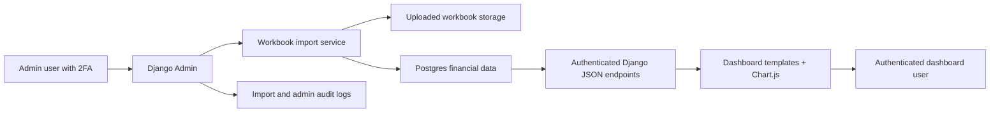

# Financial Dashboards Django/Postgres Handoff

## Current State

The repository currently contains one tracked archive, `Re_ Dashboards.zip`, and six extracted standalone HTML dashboards:

- `Mobile Network Financial Dashboard.html`
- `BWA Financial Dashboard.html`
- `ICH Financial Dashboard.html`
- `Pay Television Financial Dashboard.html`
- `Terrestrial Fibre Financial Dashboard.html`
- `Tower Infrastructure Financial Dashboard.html`

These files are browser-only applications. They load Chart.js, SheetJS, html2canvas in the mobile dashboard, and Font Awesome from public CDNs. Data is embedded directly in JavaScript constants and updated by users uploading Excel workbooks in the browser. The parsed upload results are saved in `localStorage`, so each browser has its own version of the data and there is no central database, audit trail, role model, approval flow, or server-side validation.

## Product Goal

Convert the current static dashboards into a secure Django application backed by Postgres, with Django Admin as the controlled upload and data management surface. The public-facing dashboard experience should remain familiar: filters, KPIs, charts, tables, exports, and forecast views should still work, but data should come from authenticated server APIs instead of browser-local files.

## Target Architecture

## Recommended Stack

- Backend: Django 5.x or 6.x, depending on deployment runtime compatibility.
- Database: Postgres.
- Upload parsing: `openpyxl` for `.xlsx`; reject legacy `.xls` initially unless explicitly needed.
- Admin enhancements: Django Admin plus custom import actions/forms.
- 2FA: `django-two-factor-auth` with email one-time tokens first, then TOTP app support as a stronger option.
- Frontend: existing templates and Chart.js initially, with JavaScript split into static files during migration.
- Configuration: `django-environ` or equivalent environment variable loading.
- Production server: Gunicorn or equivalent WSGI/ASGI server behind a TLS-terminating proxy.

## Domain Model

Use one canonical model family instead of one table per dashboard. This keeps new dashboard categories easier to add.

Core tables:

- `DashboardCategory`: mobile network, BWA, ICH, pay television, terrestrial fibre, tower infrastructure.
- `Company`: MTN, Telecel, AT, Telesol, DSTV, ICH, Spectrum Fibre, African Towers, etc.
- `MetricDefinition`: key, label, unit type, aliases, dashboard category, active flag.
- `FinancialPeriod`: year and optional period metadata.
- `FinancialValue`: dashboard category, company, period, metric, decimal value, source import.
- `WorkbookImport`: uploaded file metadata, dashboard category, status, uploaded by, checksum, started/completed timestamps, row counts, error summary.
- `ImportChange`: old value, new value, company, period, metric, import reference.
- `DashboardNote`: optional server-side replacement for the current browser-only notes.

Mobile-specific tables:

- `MarketShareValue`: metric type, year, company, ratio value, source import.
- `RegulatoryFeeValue`: year, company, invoice issued, payment received, outstanding, fee-to-revenue ratio, source import.

Constraints:

- Unique `FinancialValue` by category, company, period, metric, and source state.
- Store money as `DecimalField`, not float.
- Store ratios as decimals, normalized as 0.1234 for 12.34 percent.
- Keep raw uploaded workbooks for traceability, but do not serve them publicly.

## Django Admin Upload Flow

1. Admin signs in with password plus 2FA.
2. Admin chooses a dashboard category and uploads a workbook.
3. Server validates file extension, MIME type, file size, sheet names, expected year format, and metric aliases.
4. Importer parses workbook into normalized draft rows.
5. Server compares draft rows against current canonical values.
6. Admin sees a preview of new years, changed values, missing values, and parser warnings.
7. Admin confirms import.
8. Import is committed in a transaction.
9. `WorkbookImport` and `ImportChange` records preserve audit history.
10. Dashboard API immediately serves the new canonical data.

## API Contracts

Initial JSON endpoints:

- `GET /dashboards/`: list dashboards current user may view.
- `GET /api/dashboards/<slug>/summary/?year=all`: KPI and summary payload.
- `GET /api/dashboards/<slug>/metrics/?year=all&company=...`: chart-ready financial series.
- `GET /api/dashboards/<slug>/table/?year=...&company=...&metric=...`: table payload.
- `GET /api/dashboards/mobile/market-share/?year=all&metric=revenue`: mobile market share payload.
- `GET /api/dashboards/mobile/regulatory-fees/?year=all&company=...`: regulatory fee payload.

State-changing upload endpoints should stay inside Django Admin at first. That reduces attack surface and lets us rely on Django Admin permissions, CSRF, sessions, and audit logging.

## Security Baseline

- Require authentication for all dashboard pages and APIs unless the client explicitly wants public dashboards.
- Require 2FA for all staff/admin users.
- Use email 2FA only as the first step; prefer TOTP or WebAuthn for stronger production security.
- Use per-dashboard permissions: `view_dashboard`, `upload_workbook`, `approve_import`, `export_data`.
- Enforce CSRF on all state-changing views.
- Store secrets in environment variables, never in source control.
- Run `python manage.py check --deploy` in CI against production settings.
- Validate and size-limit uploads before parsing.
- Never trust workbook content. Treat all cell values and sheet names as untrusted.
- Avoid dynamic HTML injection in the migrated frontend. Use JSON APIs plus DOM-safe rendering.
- Serve third-party JS locally or use pinned assets with Subresource Integrity and a Content Security Policy.

## Implementation Plan

### Phase 0: Repo Hygiene

- Track the extracted dashboard files or move them under `legacy/`.
- Add `README.md` with setup instructions.
- Add `.gitignore` for Python, Django, virtualenv, local databases, uploaded media, and env files.
- Preserve the zip as original source material if needed, but make the extracted HTML files the editable reference.

### Phase 1: Django Foundation

- Create Django project and apps: `config`, `accounts`, `dashboards`, `imports`.
- Configure Postgres with environment variables.
- Add base settings split for dev and production.
- Add login/logout and require authentication globally for dashboard views.
- Add basic CI commands: format, tests, `manage.py check`, and `manage.py check --deploy`.

### Phase 2: Data Model and Admin

- Implement the models listed above.
- Register admin views with search, filters, readonly audit fields, and import status views.
- Seed dashboard categories, companies, and metric definitions from the legacy JavaScript constants.
- Add unit tests for constraints and decimal normalization.

### Phase 3: Workbook Importer

- Port the current SheetJS parsing rules into server-side Python import services.
- Add parser tests using small fixture workbooks for each dashboard category.
- Implement upload preview and confirm flow in Django Admin.
- Save import audit records and changed-value records.

### Phase 4: Dashboard Runtime

- Convert HTML files into Django templates.
- Move inline CSS and JavaScript into static files.
- Replace embedded data constants and `localStorage` reads with authenticated JSON API calls.
- Keep Chart.js rendering initially to reduce UI migration risk.

### Phase 5: Security Hardening

- Add 2FA for staff users.
- Configure secure production settings.
- Add upload malware scanning hook if deployment provides a scanner.
- Add CSP, Referrer-Policy, nosniff, and frame protections.
- Add rate limiting for login and upload paths.
- Add audit log review screens and export controls.

### Phase 6: Deployment Readiness

- Add Dockerfile and `docker-compose.yml` for local Postgres.
- Add production deployment notes.
- Add backup and restore procedure for Postgres and uploaded workbooks.
- Add admin runbook for importing, reverting, and verifying dashboard data.

## Open Questions

- Which users should see dashboards: only admins, internal authenticated viewers, or public visitors?
- Should workbook uploads require approval by a second user before publishing?
- Should old imports remain queryable as versions, or only current canonical values?
- What is the deployment target: Render, Vercel plus separate backend, Cloudflare, VPS, or another platform?
- Is email infrastructure already available for 2FA and password reset?
- Are uploads expected to contain sensitive financial data requiring retention limits or encryption-at-rest controls?

## Immediate Next Build Step

Create the Django project skeleton with Postgres settings, `DashboardCategory`, `Company`, `MetricDefinition`, `FinancialPeriod`, `FinancialValue`, and `WorkbookImport` models. Then add Django Admin and a first import preview flow for the BWA dashboard, because it is one of the smaller legacy dashboards and uses the same pattern as several others.
